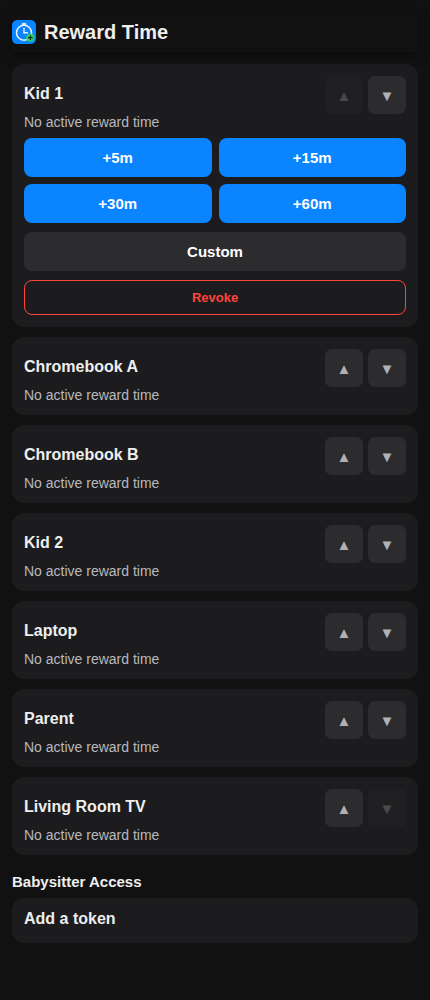
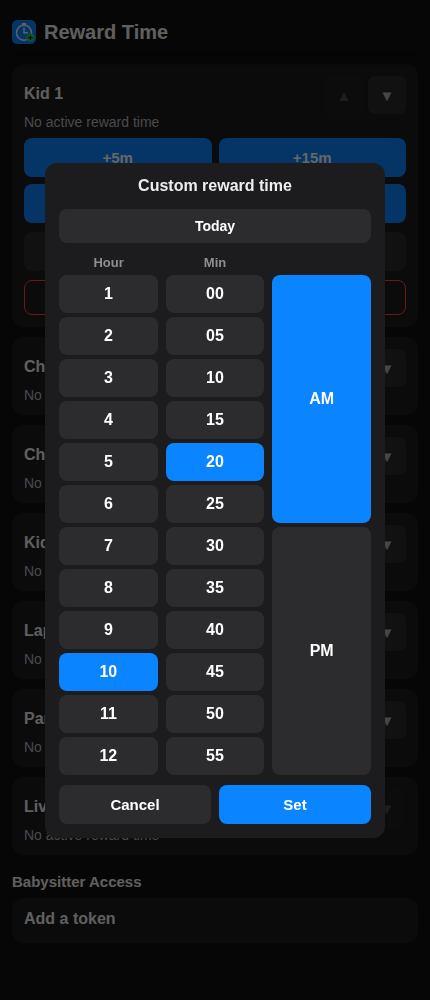
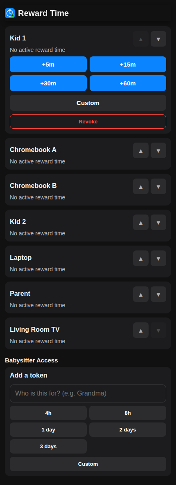
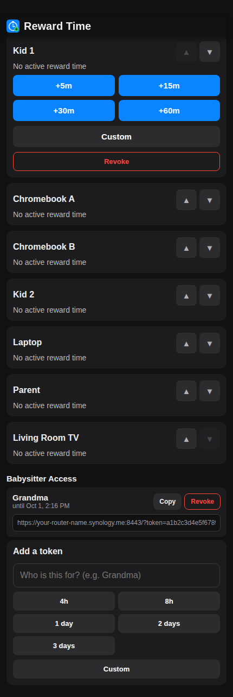

I've wanted something better than the DS router app for configuring Safe 
Access screen time for my kids.  I'd considered writing everything that is
included here but new it would be a lot of work and I wasn't that committed.
I realized yesterday that I could just ask Claude to write the app and here
we are less than 36 hours in and it does everything I wanted. This note here
is the only thing I've manually written for this project.  Everything else
was generated through Claude Code. I hope it can be useful for someone else 
in the future.


# Safe Access Reward Time

A small, self-hosted web app for adding "reward time" to a kid's device on a
Synology router running **Safe Access** (SRM's parental-control package) —
without the friction of the official DS Router app. Built for phones: big
buttons, a quick +5/+15/+30/+60 minute grid per profile, a custom date/time
picker, and time-limited "babysitter" access links you can text to someone
else so they can manage screen time themselves for a few hours or a few days.

It runs entirely on the router itself. No cloud service, no external
dependencies beyond what SRM already ships with.

## Why this exists, and why it's built the way it is

The official Safe Access apps write reward time through a specific webapi
call that also notifies SRM's enforcement daemons live. Writing directly to
the underlying SQLite database (which is tempting, since it's simple and the
data model is obvious once you've looked at it) **does not reliably apply
the change** - the value shows up as "granted" but the device doesn't
actually get network access until something else nudges the enforcement
daemons. This was discovered the hard way; see "Architecture" below for how
this app avoids it.

## What you get

- A mobile-first page per restricted profile/device with quick-add buttons,
  a revoke button, and a full custom date/time picker (with your own
  built-in calendar and hour/minute/AM-PM columns - no fiddly native input).
- Drag-free reordering (tap arrows) and collapsible cards, remembered
  per-browser.
- **Babysitter/guest access**: generate a separate link, good for anywhere
  from a few hours up to a year, that lets whoever you send it to grant or
  revoke reward time themselves - without your admin token, and without
  them being able to create more links of their own. Revoke it early anytime.
- Runs as a resilient background service: a watchdog checks real health
  (not just "is the process alive") every minute and restarts it if needed,
  and it survives router reboots.

## Prerequisites

- A Synology router or NAS running SRM/DSM with the **Safe Access** package
  installed and at least one profile with time restrictions configured.
- SSH access enabled (Control Panel -> Terminal & SNMP) and an admin-level
  account to install with.
- Roughly 20MB free space on a writable volume (`/volume1` typically exists
  even on router-only models).

This was built and tested on an RT2600ac running SRM. It should work on any
SRM/DSM device with Safe Access, but router models vary - if something in
here doesn't quite match what you see, that's likely why; the install
script tries to warn you when a key assumption doesn't hold.

## Setting up your router first

If you've never enabled SSH, set up DDNS, or added a firewall rule on SRM
before, this walks through all three - everything here is done through the
same SRM web admin page you already use for Safe Access, logged in as an
admin account.

### 1. Enable SSH

**Control Panel -> Terminal & SNMP -> Terminal** tab -> check **Enable SSH
service** -> leave the port at `22` unless you have a reason to change it
-> **Apply**.

### 2. Connect over SSH for the first time

You need a terminal/SSH client:

- **Mac or Linux**: the `Terminal` app already has `ssh` built in.
- **Windows 10/11**: `ssh` is built into PowerShell and Command Prompt -
  open either one. (Or use a GUI tool like PuTTY if you prefer.)

Connect using the same local IP address you normally use to open the SRM
web interface (not a DDNS hostname - that comes next):

```
ssh your-admin-username@192.168.x.x
```

The first time, you'll see a warning that the host's authenticity can't be
verified - type `yes` to continue. Then enter your admin password (the
same one you use to log into SRM); nothing will appear on screen as you
type, which is normal for password prompts. A prompt like `~$` means
you're in.

### 3. Set up DDNS

Your router's public IP can change, so the app needs a stable hostname to
be reachable from outside your home - this also solves the "my phone can't
reach it when I'm away" problem that `https://192.168.x.x` addresses can't,
since that address only works on your home network.

**Control Panel -> External Access -> DDNS -> Add**:

- **Service Provider**: `Synology` is the simplest option if you have a
  Synology account - it gives you a free `something.synology.me` hostname
  with nothing else to configure. A third-party provider (No-IP, etc.)
  works too if you already have an account with one.
- **Hostname**: pick anything available - it doesn't need to relate to
  your real name. Anyone who later gets your app link will see this
  hostname, though they'd also need the long random access token the
  installer generates to actually do anything with it.
- Follow whatever sign-in/verification step that provider asks for.
- After saving, the **Status** column should turn to a green "Normal"
  within a minute or so.

Keep this hostname handy - the installer asks for it in the next section.

### 4. Open the firewall for the app's port

This uses the port you'll choose during installation (the installer
defaults to `8443`), so you can do this step either now (using `8443`
unless you plan to pick something else) or right after installing.

**Control Panel -> Security -> Firewall**:

- Make sure the firewall is enabled. If this is the first custom rule
  you're adding, SRM may prompt you to create a default "allow" rule
  first - that's fine, accept it.
- Select the rule set for your main network interface (usually named
  something like `LAN 1`), then **Edit Rules -> Create**.
- Set **Ports** to **Custom**, protocol **TCP**, port `8443` (or your
  chosen port); **Source IP** to **All**; **Action** to **Allow**.
- **OK**, then **Save**. Make sure the new rule is enabled (checkbox) - if
  you already have other custom rules, order only matters if an earlier
  rule would otherwise block or shadow this one.

Without this step, the app only works from inside your home network.

**If your Synology device isn't your main internet gateway** - e.g. it's
running in Access Point mode, or another router does your actual NAT/port
forwarding - you'll also need to forward this same TCP port to this
device's LAN IP address on *that* router. The steps for that vary by
brand/model, so check that router's own documentation.

## Installing

1. SSH into the device as your admin account (not root) - see above if
   you haven't enabled/used SSH on this device before.
2. Pick a permanent home for the app and clone/copy this repo directly into
   it - it can't relocate itself afterward, so choose the real location up
   front. For example:

   ```
   cd /volume1
   mkdir reward-time && cd reward-time
   # copy this repo's files into this directory
   ```

3. Run the installer from inside that directory:

   ```
   sh install.sh
   ```

   It'll ask a few questions (HTTPS port, your router's DDNS hostname from
   step 3 above), generate a random access token and a self-signed
   certificate, fill in the scripts with your settings, and then print out
   the handful of commands that need root - copy/paste those into an `su`
   shell yourself. Nothing is auto-elevated; you see and run every
   privileged step.

4. If you haven't already, add the firewall rule from step 4 above for the
   port you just chose.

5. Open the URL the installer printed, bookmark it or add it to your
   phone's home screen.

Since it's a self-signed certificate by default, your browser will warn you
the first time. You can just tap through it, or - to make the warning go
away permanently - AirDrop/email yourself `cert/fullchain.pem`, install it
as a profile on your phone, then enable full trust for it under
**Settings -> General -> About -> Certificate Trust Settings** (iOS) or your
Android device's equivalent.

### Reusing a real certificate instead

If your router already has Let's Encrypt (or another real) certificate for
its own admin login page, `cert-sync.sh` can copy that into this app instead
of the self-signed one, so there's no browser warning at all. It's already
filled in with your settings from the installer, and was copied into the
root-owned `<your-install-dir>-root` directory along with the other parts
that run as root. To use it:

```
su -c '<your-install-dir>-root/cert-sync.sh'
```

and to keep it in sync automatically going forward, add (as root):

```
printf '0\t6\t*\t*\t5\troot\t<your-install-dir>-root/cert-sync.sh\n' >> /etc/crontab
/usr/syno/sbin/synoservicectl --restart crond
```

(Friday mornings, a few hours after SRM's own certificate renewal check.)
This only works if your router's certificate setup matches what this script
expects (a leaf-only `server.crt`/`server.key` pair at the standard SRM
path, chain completed via the local admin HTTPS port) - if it fails, you're
no worse off than the self-signed default.

## Using it

Open the app link. Each restricted Safe Access profile (a kid's account, or
a specific device) gets its own collapsed card, showing whether it
currently has active reward time:


Tap a card's header to expand it:



This reveals four quick-add buttons - tap one for an instant grant. They
stack: tap **+15m** then **+30m** right after and the device ends up with
45 minutes total, with no need to wait for the first tap to finish before
making the next one. There's also **Custom** for an exact date/time, and
**Revoke** to end active reward time immediately. Use the small up/down
arrows to reorder cards, and tap a header again to collapse it - both are
remembered per-browser, not shared across devices.

### Custom date & time

Tapping **Custom** opens a picker sized to fit your screen without
scrolling: pick a date from the calendar (it opens on today), then an
hour, minute, and AM/PM, and tap **Set**.



The picker closes immediately after you tap **Set** - it applies in the
background, so you can move straight on to another device rather than
waiting for it to finish.

### Babysitter / guest access

At the bottom, the "Add a token" card lets you name who a temporary access
link is for and choose how long it should last - a preset number of hours
or days, or an exact date/time up to a year out:



Creating one copies the link straight to your clipboard - ready to text or
message to whoever needs it - and shows it in the list above. It works
like your own link, except it can only grant or revoke reward time; it
can't create more links or see this list. Tap an entry in the list to
reveal its full link again later (handy if you need to resend it) - the
text field is selectable so you can copy it manually:



Revoke a token early right from its row, or just let it expire on its own.

## Architecture

```
Browser  --HTTPS-->  reward_server.py (runs as your regular user, unprivileged)
                          |
                          |  writes a small request file, waits briefly
                          v
                     pending/*.json
                          ^
                          |  polls every ~0.3s
                          |
                     apply_daemon.py (runs as root - required for the next step)
                          |
                          v
              synowebapi: SYNO.SafeAccess.AccessControl.ConfigGroup.Reward.Ultra
                          |
                          v
                 Safe Access's own enforcement daemons (notified live)
```

`reward_server.py` never touches the Safe Access database directly for
writes - only for fast, read-only status display. All writes go through
`apply_daemon.py`, which is the only part of this app that needs root, and
its only job is calling the same official API the Synology apps use. This
split exists specifically because a direct database write does *not*
reliably trigger live enforcement - confirmed by testing both paths against
a real device.

Everything else (watchdogs, boot scripts, log rotation, TLS handshake
timeouts to survive internet port-scanning) exists because this app is
reachable from the open internet by design, and needs to keep running
unattended.

## Troubleshooting

- **Nothing loads / connection refused from outside your home network**:
  almost always the firewall rule (see "Setting up your router first"
  above), or your router's public IP having changed with DDNS not yet
  caught up (check **Control Panel -> External Access -> DDNS**, re-save
  the entry to force an update).
- **Grant/revoke says success but the device doesn't actually get
  internet**: check that `apply_daemon.py` is actually running
  (`ps w | grep apply_daemon.py`) and check `apply_daemon.log` in the
  `<your-install-dir>-root` directory for errors - most commonly this means the boot service wasn't
  installed correctly, or the root crontab watchdog entry is missing.
- **"Failed - check connection" on a request**: as of this version this
  should be rare - errors now surface the server's actual reason (e.g. a
  date picked too far out). If you see the generic message, check
  `server.log`.
- **A request seems to hang for exactly 5 seconds then fails**: means
  `apply_daemon.py` isn't picking up requests - check it's running and
  check its log.

## Uninstalling

As root:

```
/usr/local/etc/rc.d/reward-time.sh stop
/usr/local/etc/rc.d/reward-apply.sh stop
rm /usr/local/etc/rc.d/reward-time.sh /usr/local/etc/rc.d/reward-apply.sh
```

Then edit `/etc/crontab` to remove the lines this app added
(`app_watchdog.sh`, `apply_watchdog.sh`, and `cert-sync.sh` if you enabled
it), restart crond (`/usr/syno/sbin/synoservicectl --restart crond`), and
delete both the app's install directory and its `-root` companion.

## Security notes

- The app is gated by a long random bearer token in the URL - anyone with
  the link has full access (or, for a babysitter link, access limited to
  granting/revoking reward time until it expires). Don't post the link
  anywhere public.
- It's directly internet-facing by design (that's the point - so you can
  use it away from home). It will get hit by routine internet-wide
  vulnerability scanners; the server handles this deliberately (threaded,
  per-connection timeouts, no endpoints beyond what it needs), but you
  should understand that's the tradeoff before exposing it.
- `apply_daemon.py` runs as root, but its attack surface is narrow: it only
  reads small JSON files from the app's `pending/` directory (written only
  by the unprivileged app, which validates and range-checks everything
  before writing) and calls one fixed `synowebapi` command with those
  values.
- Everything that runs as root (`apply_daemon.py`, the two watchdog
  launchers, `cert-sync.sh`) lives in a separate root-owned
  `<your-install-dir>-root` directory, never in the app's own directory.
  The app directory is writable by the app user - and so, in the worst
  case, by anyone who compromises the internet-facing server - so if root
  ran anything from there, that would be a path to root. For the same
  reason, root never follows a path inside the app directory that could be
  a planted symlink: `apply_daemon.py` reads requests with `O_NOFOLLOW` and
  writes its status files via fresh, randomly named files, and
  `cert-sync.sh` and the boot scripts do everything inside the app
  directory as the app user (via `su`).

## Running the tests

The schedule logic has unit tests that run on both the router's Python 2.7
and Python 3:

```
python3 -m unittest discover -s tests -t .     # on your own computer
tests/run_on_router.sh <ssh-host>               # on the router itself
```

## License

MIT - see [LICENSE](LICENSE).
